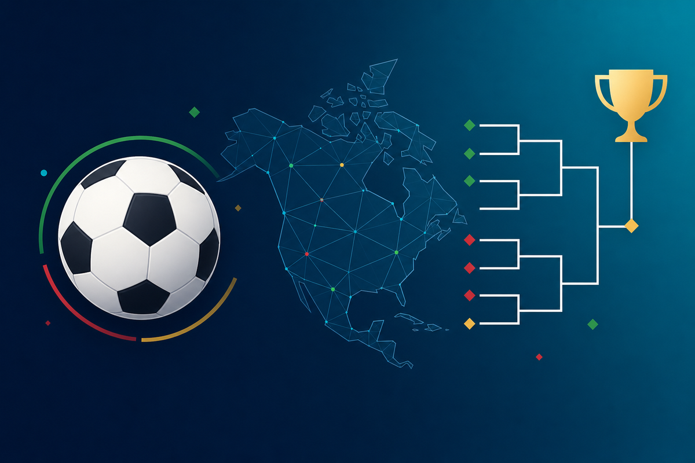

# WC 2026 - Home Assistant Integration

<p align="center">
  
</p>

<p align="center">
  <a href="https://github.com/eisenkarl/ha-wm-2026/releases"></a>
  <a href="LICENSE"></a>
  
  
  
</p>

A complete Home Assistant solution for tracking the FIFA World Cup 2026 (USA / Canada / Mexico, June 11 - July 19, 2026). Provides daily overview, all 12 groups with live tables, full knockout bracket and push notifications for your favorite team — directly in Home Assistant. Available in German and English.

**Deutsche README:** [README.md](README.md)

## Features

- **Daily overview** of all WC matches (today or next matchday with countdown)
- **Complete group stage** - all 12 groups (A-L) with live tables and all 72 matches
- **Complete knockout stage** - Round of 32, Round of 16, Quarterfinals, Semifinals, 3rd-Place Match, Final
- **Favorite team tracker** - freely choose from 49 teams (default: Germany)
- **Multilingual** - switch between German (de) and English (en) via UI dropdown
- **National flag images** for all teams (via flagcdn.com, no API key needed)
- **Live scores** and automatic **winner highlighting** during matches
- **Push notifications** (optional, via blueprint):
  - Daily preview (configurable time)
  - Kick-off reminder 10 min before favorite team match
  - Half-time + Full-time live updates
- **No API keys required** — uses public ESPN JSON API

## Requirements

- Home Assistant **2024.6** or newer (for Blueprint auto-discovery & input_select)
- `python3` in HA Core container (default installed)
- Optional: **Mobile App Companion** for push notifications

## Installation

### Step 1: Enable package support (one-time)

In your `configuration.yaml` add (if not already present):

```yaml
homeassistant:
  packages: !include_dir_named packages
```

Then create `/config/packages/` directory if it doesn't exist.

### Step 2: Copy files

| Source (from this repo) | Destination in your HA |
|---|---|
| `packages/wm2026.yaml` | `/config/packages/wm2026.yaml` |
| `python_scripts/wm2026_bracket.py` | `/config/python_scripts/wm2026_bracket.py` |
| `blueprints/automation/wm2026_notifications.yaml` | `/config/blueprints/automation/wm2026/wm2026_notifications.yaml` |

**Python script path note:** The HA `python_scripts` component (sandbox) is **not** used here. The path `/config/python_scripts/` is just a directory; the script is executed via `command_line`.

```bash
chmod +x /config/python_scripts/wm2026_bracket.py
```

### Step 3: Restart HA

`Settings → System → Restart`

### Step 4: Verify

After restart, check:

`Developer Tools → States` — look for:
- `sensor.wm_2026_api`
- `sensor.wm_2026_bracket` (state should be `104`)
- `sensor.wm_2026_spiele_heute`
- `sensor.wm_2026_naechster_spieltag`
- `sensor.wm_2026_lieblings_team_naechstes_spiel`
- `input_select.wm_2026_favorite_team`
- `input_select.wm_2026_language`

### Step 5: Add dashboard

`Settings → Dashboards → Add dashboard → "New dashboard from scratch"`

Name e.g. `WC 2026`, icon `mdi:soccer`.

Open dashboard → pencil icon → 3-dot menu → **Raw configuration editor** → replace entire content with `dashboards/wm2026_dashboard.yaml`.

### Step 6 (optional): Enable push notifications

`Settings → Automations & Scenes → Blueprints → Create Automation`

Select **"WM 2026 - Push Notifications (de/en)"** and configure:

- **Notify Service:** e.g. `notify.mobile_app_myphone`
- **Daily Preview Time:** e.g. `08:00:00`
- **Toggles:** as desired

## Configuration

### Change language

In the dashboard or directly via `Settings → Devices & Services → Helpers → WM 2026 Language / Sprache`. Options: `de` (German), `en` (English).

The change is **instant** — an automation refreshes the bracket sensor immediately when language or favorite team changes.

### Change favorite team

Same place: `input_select.wm_2026_favorite_team`. 49 teams preconfigured (3-letter FIFA codes: `GER`, `AUT`, `SUI`, `BRA`, `ARG` ...). To add more teams edit the options list in `packages/wm2026.yaml`.

### Update interval

Defaults:
- **Daily overview** (REST API): every 5 minutes
- **Full bracket** (Python script): every 30 minutes
- **Manual refresh:** `Developer Tools → Actions → homeassistant.update_entity → sensor.wm_2026_bracket`

## Data source

This app uses the unofficial ESPN JSON API (`site.api.espn.com`), publicly accessible, no auth required. Please be fair — keep polling intervals ≥ 5 min.

ESPN is not affiliated with this project. If the API is unavailable, sensors keep their last known state.

## Troubleshooting

### Sensors stay `unknown` / `unavailable`

1. Check logs: `Settings → System → Logs`, filter for `wm_2026`
2. Test the script manually via SSH:
   ```bash
   python3 /config/python_scripts/wm2026_bracket.py GER en
   ```
   Should output JSON. If errors: check internet access from HA Core container.
3. Test ESPN API:
   ```bash
   curl https://site.api.espn.com/apis/site/v2/sports/soccer/fifa.world/scoreboard
   ```

### Configuration invalid after install

- Make sure `packages: !include_dir_named packages` is in `configuration.yaml` under `homeassistant:`
- File must be exactly at `/config/packages/wm2026.yaml`
- Check YAML indentation: `Settings → System → Repairs → Check Configuration`

### Push notifications not arriving

- Mobile App Companion installed and registered in HA?
- Correct notify service entered? (`Developer Tools → Actions → "notify."` to search)
- Each function toggle enabled in the blueprint automation?

## License

MIT — see `LICENSE`. Free for private and commercial use.

## Contributing

Pull requests welcome. For issues please include:
- HA version
- State of affected sensors
- Log excerpts

## Credits

- **ESPN** for the public sports data API
- **flagcdn.com** for free flag images
- **Home Assistant Community** for the great platform
